# terra-4
Продвинутые методы работы с Terraform

## Задание 1. 
### main.tf:
```
#создаем облачную сеть
resource "yandex_vpc_network" "develop" {
  name = var.vpc_name
}

#создаем подсеть
resource "yandex_vpc_subnet" "develop_a" {
  name           = "develop-${var.default_zone}"
  network_id     = yandex_vpc_network.develop.id
  v4_cidr_blocks = var.default_cidr
}

resource "yandex_vpc_subnet" "develop_b" {
  name           = "develop-${var.zone_b}"
  zone           = var.zone_b
  network_id     = yandex_vpc_network.develop.id
  v4_cidr_blocks = var.cidr_1002
}


module "test-vm" {
  source         = "git::https://github.com/udjin10/yandex_compute_instance.git?ref=main"
  env_name       = var.vm_marketing.env_name
  network_id     = yandex_vpc_network.develop.id
  subnet_zones   = [var.default_zone,var.zone_b]
  subnet_ids     = [yandex_vpc_subnet.develop_a.id,yandex_vpc_subnet.develop_b.id]
  instance_name  = var.vm_marketing.instance_name
  instance_count = var.vm_marketing.instance_count
  image_family   = var.vm_family
  public_ip      = var.vm_marketing.public_ip

  labels = { 
    owner= var.vm_marketing.owner,
    project = var.vm_marketing.project
     }

  metadata = {
    user-data          = data.template_file.cloudinit.rendered #Для демонстрации №3
    serial-port-enable = 1
  }

}

module "example-vm" {
  source         = "git::https://github.com/udjin10/yandex_compute_instance.git?ref=main"
  env_name       = var.vm_analytics.env_name
  network_id     = yandex_vpc_network.develop.id
  subnet_zones   = [var.default_zone]
  subnet_ids     = [yandex_vpc_subnet.develop_a.id]
  instance_name  = var.vm_analytics.instance_name
  instance_count = var.vm_analytics.instance_count
  image_family   = var.vm_family
  public_ip      = var.vm_analytics.public_ip
    
  labels = { 
    owner= var.vm_analytics.owner,
    project = var.vm_analytics.project
     }

  metadata = {
    user-data          = data.template_file.cloudinit.rendered #Для демонстрации №3
    serial-port-enable = 1
  }

}

#Пример передачи cloud-config в ВМ для демонстрации №3
data "template_file" "cloudinit" {
  template = file("./cloud-init.yml")
  vars = {
    ssh_public_key     = file(local.ssh_key)
  }
}
```
### cloud-init.yml:
```
#cloud-config
users:
  - name: ubuntu
    groups: sudo
    shell: /bin/bash
    sudo: ["ALL=(ALL) NOPASSWD:ALL"]
    ssh_authorized_keys: [${ssh_public_key}]
package_update: true
package_upgrade: false
packages:
  - vim
  - nginx
```

Выводи из консоли:
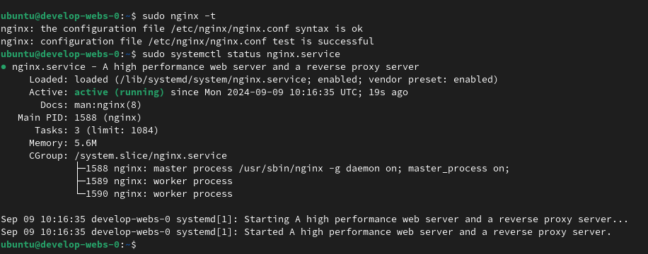

Метки из консоли:

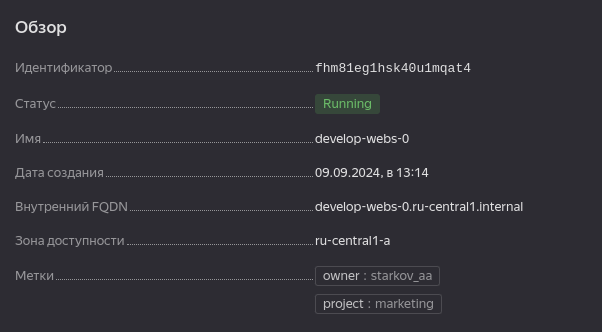
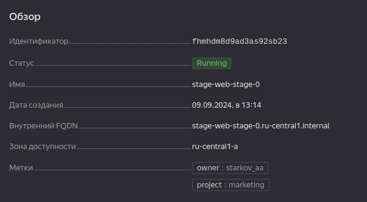

Вывод модулей из консоли терраформа:

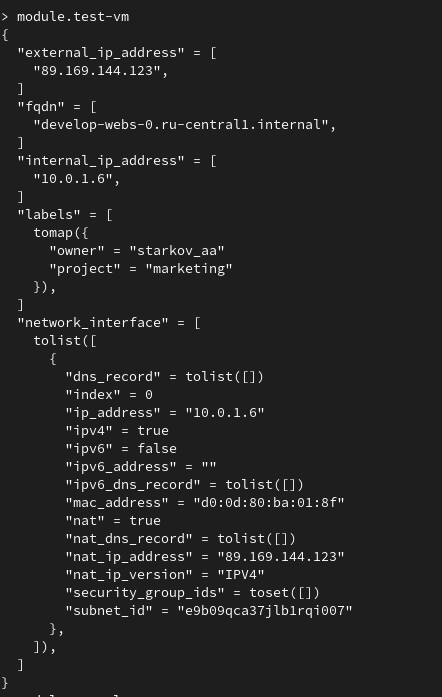
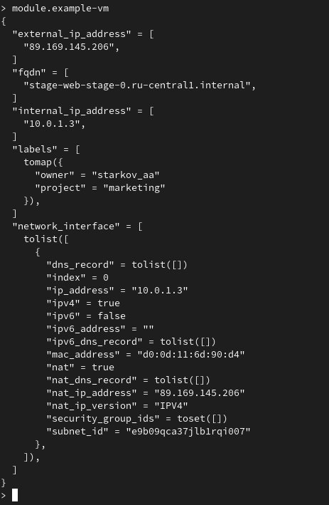

## Задание 2.

### Измененный main.tf:
```
#создаем облачную сеть
/*resource "yandex_vpc_network" "develop" {
  name = var.vpc_name
}

#создаем подсеть
resource "yandex_vpc_subnet" "develop_a" {
  name           = "develop-${var.default_zone}"
  network_id     = yandex_vpc_network.develop.id
  v4_cidr_blocks = var.default_cidr
}

resource "yandex_vpc_subnet" "develop_b" {
  name           = "develop-${var.zone_b}"
  zone           = var.zone_b
  network_id     = yandex_vpc_network.develop.id
  v4_cidr_blocks = var.cidr_1002
}*/

module "vpc" {
  source            = "./vpc"
  env_name          = var.vpc_name
  zone              = var.default_zone
  v4_cidr_block     = var.default_cidr
}

module "test-vm" {
  source         = "git::https://github.com/udjin10/yandex_compute_instance.git?ref=main"
  env_name       = var.vm_marketing.env_name
#   network_id     = yandex_vpc_network.develop.id
  network_id     = module.vpc.vpc_network.id
  subnet_zones   = [var.default_zone,var.zone_b]
  subnet_ids     = [module.vpc.vpc_subnet.id]
  instance_name  = var.vm_marketing.instance_name
  instance_count = var.vm_marketing.instance_count
  image_family   = var.vm_family
  public_ip      = var.vm_marketing.public_ip

  labels = { 
    owner= var.vm_marketing.owner,
    project = var.vm_marketing.project
     }

  metadata = {
    user-data          = data.template_file.cloudinit.rendered #Для демонстрации №3
    serial-port-enable = 1
  }

}

module "example-vm" {
  source         = "git::https://github.com/udjin10/yandex_compute_instance.git?ref=main"
  env_name       = var.vm_analytics.env_name
  network_id     = module.vpc.vpc_network.id
  subnet_zones   = [var.default_zone]
  subnet_ids     = [module.vpc.vpc_subnet.id]
  instance_name  = var.vm_analytics.instance_name
  instance_count = var.vm_analytics.instance_count
  image_family   = var.vm_family
  public_ip      = var.vm_analytics.public_ip
    
  labels = { 
    owner= var.vm_analytics.owner,
    project = var.vm_analytics.project
     }

  metadata = {
    user-data          = data.template_file.cloudinit.rendered #Для демонстрации №3
    serial-port-enable = 1
  }

}

#Пример передачи cloud-config в ВМ для демонстрации №3
data "template_file" "cloudinit" {
  template = file("./cloud-init.yml")
  vars = {
    ssh_public_key     = file(local.ssh_key)
  }
}
```
### main.tf модуля vpc:
```
terraform {
  required_providers {
    yandex = {
      source = "yandex-cloud/yandex"
    }
  }
  required_version = ">=0.13"
}
#создаем облачную сеть
resource "yandex_vpc_network" "net" {
  name = var.env_name
}

#создаем подсеть
resource "yandex_vpc_subnet" "subnet" {
  name           = "${var.env_name}-subnet"
  network_id     = yandex_vpc_network.net.id
  v4_cidr_blocks = var.v4_cidr_block
  zone           = var.zone
}
```
### outputs.tf модуля vpc:
```
output "vpc_network"{
    value=yandex_vpc_network.net
    description="vpc network"
}
output "vpc_subnet"{
    value=yandex_vpc_subnet.subnet
    description="vpc subnet"
}
```
Вывод консоли терраформ

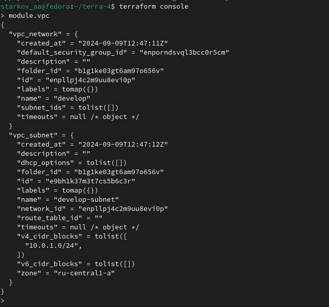

Документация модуля с помощью Terraform-docs

```docker run --rm --volume "$(pwd):/terraform-docs" -u $(id -u) quay.io/terraform-docs/terraform-docs:0.16.0 markdown /terraform-docs```

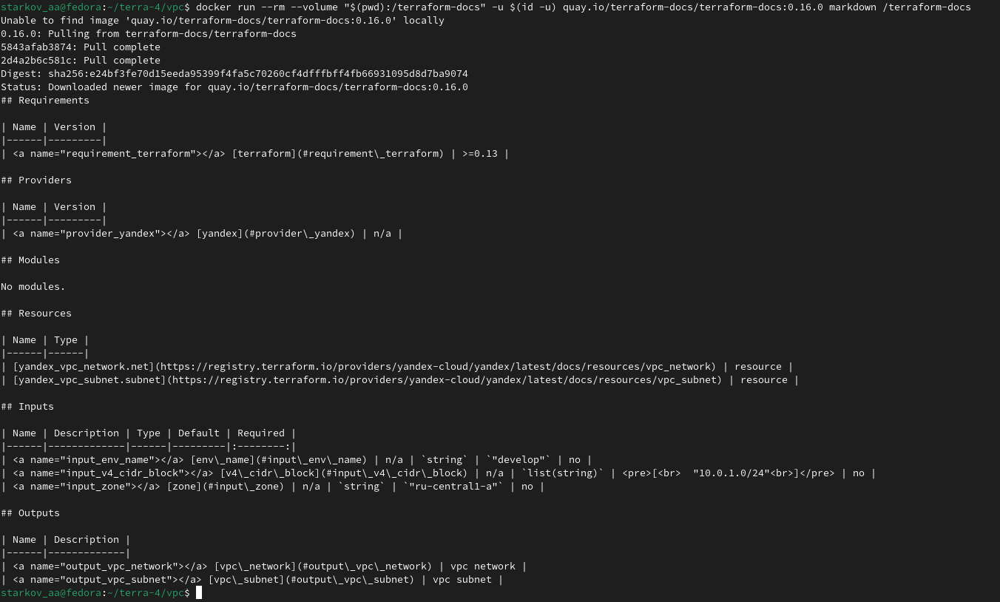

## Задание 3.

Удаление всех модулей

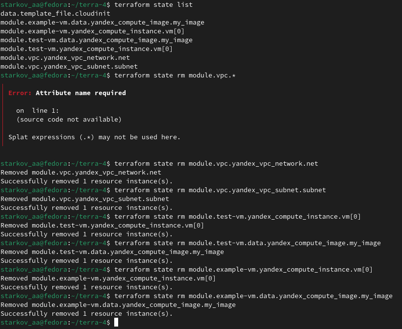

Импорт модулей

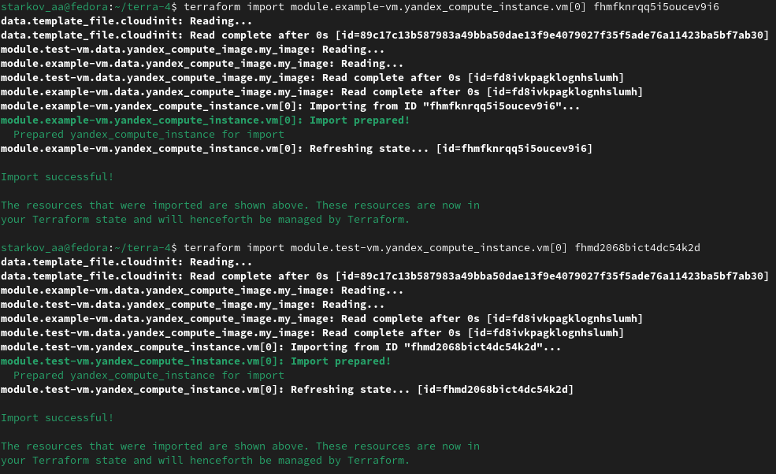
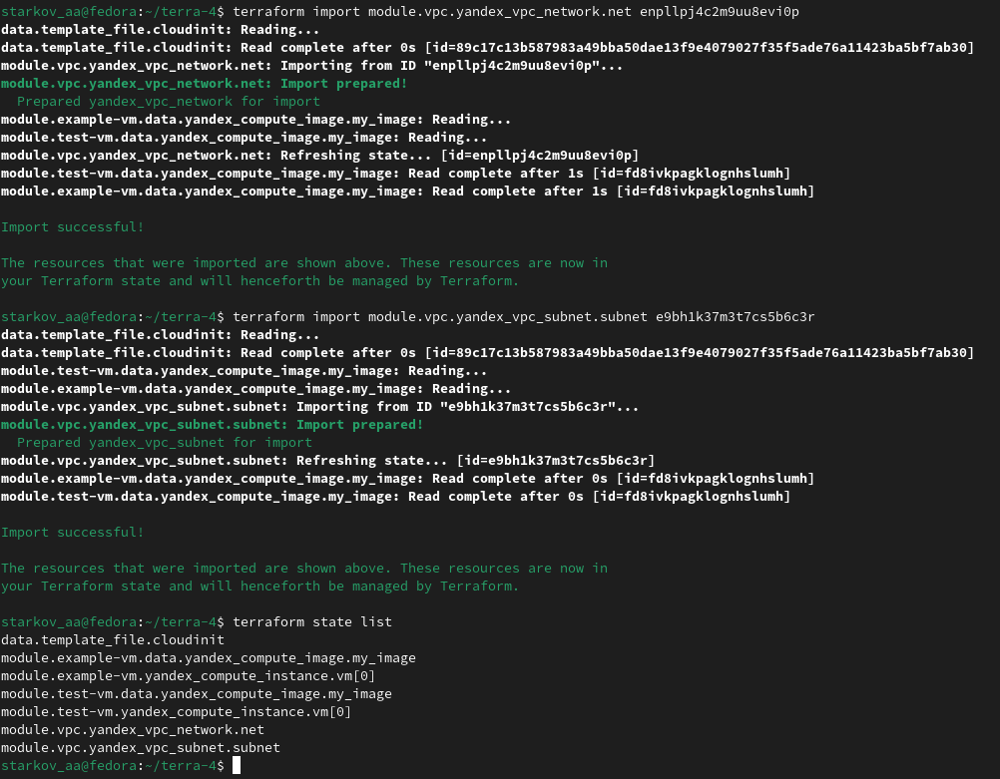

Выполнение команды terraform plan

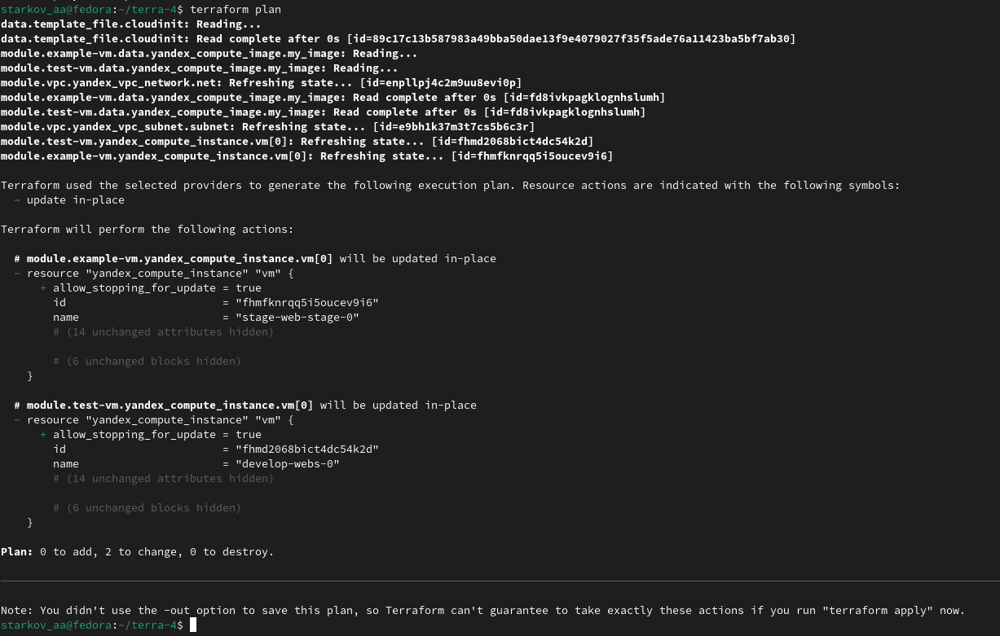
